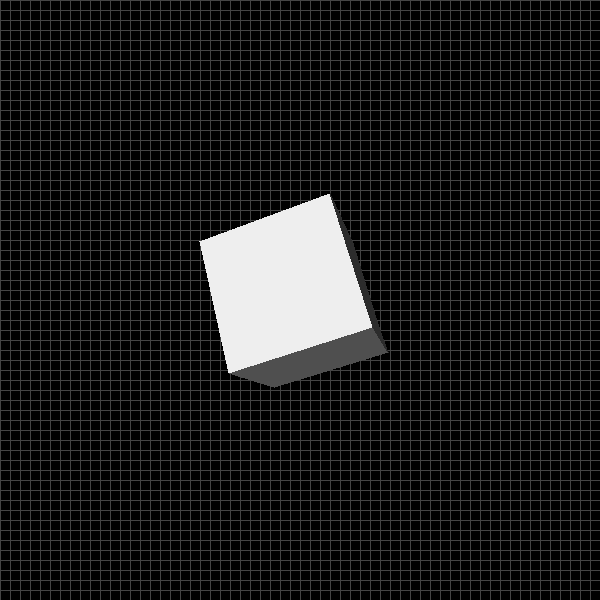
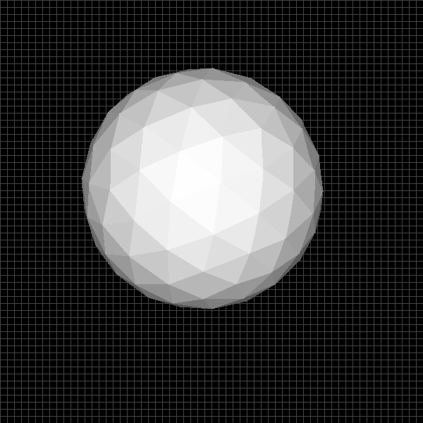

# Introduction

This is a basic 3d CPU based renderer for polygon meshes built in vanilla C++. It just leverages [Simple DirectMedia Layer (SDL)](https://www.libsdl.org/) for low level access to graphics hardware.





# Features

* Fixed time step in the game loop (delta time)
* RGB color buffer
* File parser to impor OBJ files
* Custom helpers for math operations (Vec2, Vec3, Mat4, etc.)
* Perspective projection (aspect ratio, field of view and normalized z)
* Digital differential analyzer (DDA) algorithm for drawing lines
* Flat-Bottom & Flat-Top technique scanfill for filling triangles
* Back-face culling for visibility checks
* Graphics pipeline to move from model space to screen space
* Basic flat shading
* Look at camera model

# Compilation

This renderer is implemented in C++ 17 and [SDL2](https://www.libsdl.org/) so you should be able to build it in Windows, Linux and OSX. A basic Makefile file is provided

# Usage

```
./3d-software-renderer WINDOW_WIDTH WINDOW_HEIGHT PATH_TO_OBJ_FILE
```

Example:

```
./3d-software-renderer 800 600 assets/cube.obj
```
